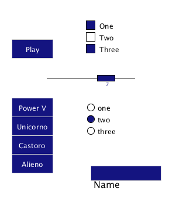

# JGUILib 

A simple and user-friendly GUI library for processing



### Components and utils:
* [Controller](./JGUILib/JGUIController.pde)
* [Button](./JGUILib/JGUIButton.pde)
* [Callback](./JGUILib/Callback.pde)
* [Dropdown](./JGUILib/JGUIDropdown.pde)
* [Textfield](./JGUILib/JGUITextfield.pde)
* [Slider](./JGUILib/JGUISlider.pde)
* WIP checkbox
* WIP radiobutton

### How to use:
First of all you need to instantiate the controller object
```java
JGUIController controller = new JGUIController();
```

Now you can add to it all your customized components, for example:
```java
  controller.add(
    new JGUIButton("Play", 200, 200)
      .setSize(35, 16)
      .setFillColor(color(20, 20, 128))
      .setTextColor(color(255, 255, 255))
      .setCallback(onClickCallback)
  );
  
  JGUIDropdown dd =
    new JGUIDropdown("Power", 200, 300)
      .setSize(35, 16)
      .setFillColor(color(20, 20, 128))
      .setTextColor(color(255, 255, 255))
      .addButton(new JGUIButton("Unicorno"))
      .addButton(new JGUIButton("Castoro"))
      .addButton(new JGUIButton("Alieno"));
  controller.add(dd);

  JGUITextfield tf =
    new JGUITextfield(300,400)
      .setSize(120,25)
      .setLabel("Name")
      .setLabelColor(color(0, 0, 0))
      .setFillColor(color(20, 20, 128))
      .setTextColor(color(255, 255, 255));
  controller.add(tf);

  JGUISlider sl =
    new JGUISlider(300,250, 1, 10)
      .setSize(150,20)
      .setFillColor(color(20, 20, 128))
      .setCallback(onSlideCallback);
  controller.add(sl);
```

Create a global callback for your buttons, binded as in the previous example
```java
Callback onClickCallback = new CallbackFunction() {
  void execute(JGUIButtonGeneric o) { 
    // DO STUFFS
  }
};
```

When everything is set up you can just call the controller handle function inside the draw() loop and it will handle every added component
```java
void draw() 
{
  // REDRAW STUFFS
  controller.handle();
  // MORE STUFFS
}
```

Note if you use some textfield you must include the event handler this way
```java
void keyPressed() {
  tf.keyPressed();
}
```

### Removing components
You can clear all the controller or delete a specific component from it
```java
// Components from previous examples
controller.remove(dd);
controller.remove(tf);

controller.clear();
```

### Chaining allowed:
As prevoiusly showed, chaining can be used for compacting sintax as every customization of a components returns the component itself
```java
dd.setFillColor(color(20, 20, 128))
  .setTextColor(color(255, 255, 255))
  .addButton(new JGUIButton("Unicorno"))
  .addButton(new JGUIButton("Castoro"))
  .addButton(new JGUIButton("Alieno"))
  .setVisible(false)
  // AND SO ON
    ;
```

### Android support
The main reason for this project is the lack of GUI libraries in processing that includes the support for Android compilation. So the main goal for this library is to always support cross compiling.